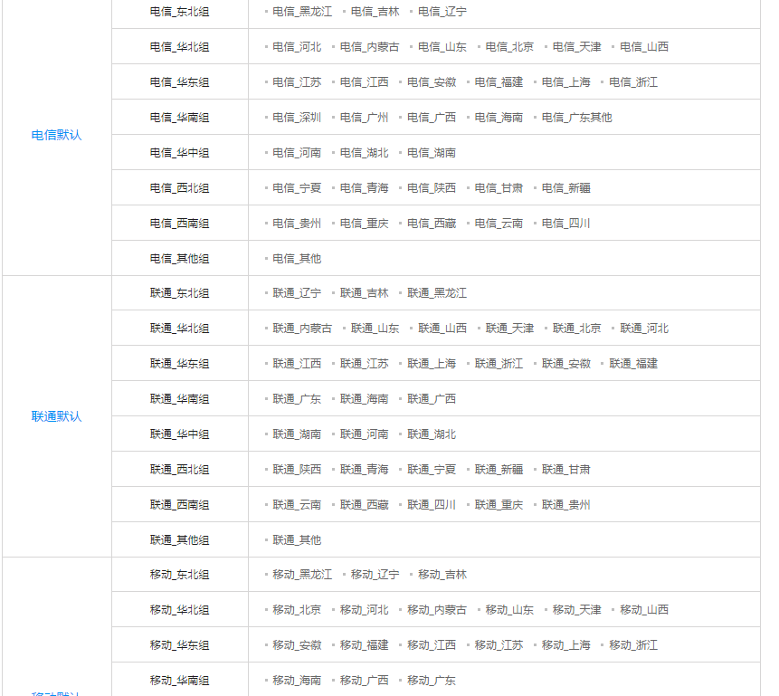
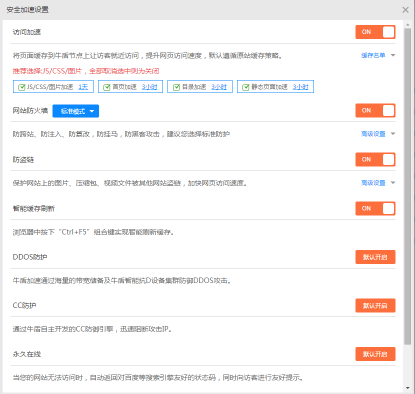

使用 CloudXNS 已有 3 个多月了，还记得当初是看到 TYPCN 在博客上的推荐，才“入坑”的。<!--more-->

## 0x00 为什么是 CloudXNS？

> 随着网络的发展，用户处在不同的运营商网络中，当用户跨运营商跨地区访问的时候，智能 DNS 平台使访问网站的联通用户访问联通的服务器，电信的用户访问电信的服务器，提升网站速率。
> CloudXNS 是在传统 DNS 系统上加入策略解析后的高级智能 DNS 系统，可以判断用户来源，就近访问调度。
> 不但拥有主流 DNS 产品的全部功能，而且扩展有自己独有的解析记录类型，在解析速度方面也明显优于国内其他同类产品，它的解析速度比传统 DNS 快两到三倍，DNS 配置生效更快，可做到实时生效。

详情：[了解 XNS:选择 CloudXNS 的九大优势](https://www.cloudxns.net/Index/AboutXns.html)

## 0x01 CloudXNS 拥有众多线路

因为我目前只是一个小博客，暂时没有这方面的需求，所以这个功能对我来说用处并不是很大。但是因为它，使我的博客在备案期间`伪关站`。

我将线路切换到 `海外默认` 和 `搜索引擎默认` 保证了搜索引擎的正常抓取以及部分有特殊上网技巧的人可以访问的我博客。

## 0x02 CloudXNS 提供实时宕机报警，并且可以智能切换节点

我在用 Gitcafe Page 的时候，他们提供服务器经常宕机，多亏 CloudXNS 让我可以及时了解服务器动态（不过我那时并没有在 GitHub Page 上搭建备用博客，所以没有尝试智能切换）

## 0x03 统计数据全面

这是我今天（2015/6/19）的解析统计：

按运营商查看：

## 0x04 CloudXNS 提供免费的 CDN 服务

MX 和 CNAME 记录是不能共存的，如果我想在裸域上使用 CDN 又不影响邮箱服务，很明显是不大可能的。

但是 CloudXNS 提供的 CDN 就完美的解决了问题。

点击启用：

设置页面：

## 0x005 END

本文只是介绍我目前所使用到的功能，想了解更多 CloudXNS 的功能（如：利用 CNAMEX 实现多 CDN），请访问[官网](https://www.cloudxns.net/)。
