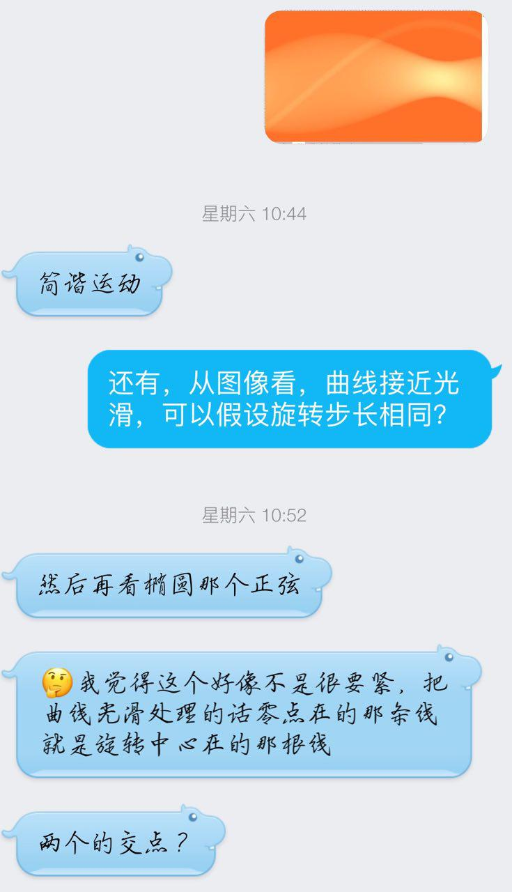
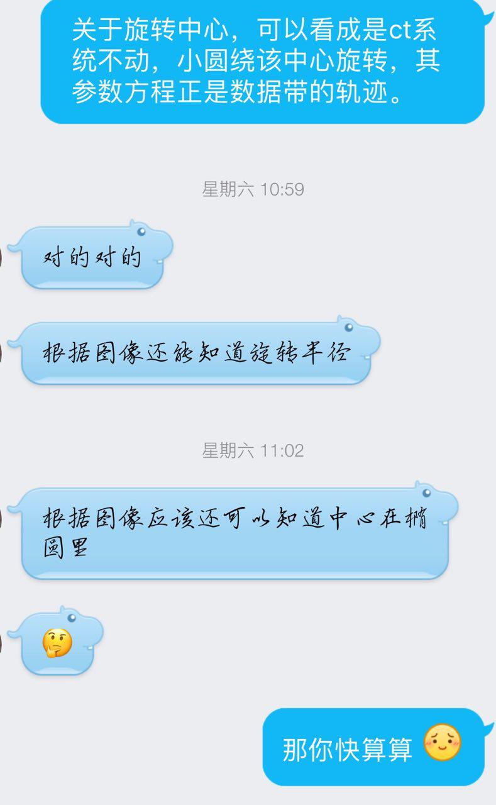

最近参加了全国大学生数学建模竞赛，挺好玩的，故作此文记录。<!--more-->

## 起因

上学期大项目组队，本来我们是三个人，结果其中一个队友拉了一个小姐姐进来。刚开始以为小姐姐是来抱大腿的（大腿不是我），后来发现她虽然代码写的不好，但是很积极，给的任务也很快地完成……唔好像跑题了

反正，就是这样，我认识了她。然后这个小姐姐高数可厉害了，直接免考拿优 Orz。

之后，她就找我谈组队的事。一开始我是不想参加的，因为我对算法很不感冒，怕拖后腿。但是她劝我说，数学建模的算法都是确定的，可以查资料。好嘛，不就是实现算法嘛。于是，我就答应了。

## 队伍详情

我们的队伍有我、小姐姐、还有一个学物理的。其中只有小姐姐有数模经验（校赛），还没有获奖。队伍配置应该是所有参赛队里最渣的了

## Day 0

晚上 8 点钟，题目出来了。A 题是 CT 相关，需要很强的数学和编程能力，涉及图像重建、矩阵变化、傅立叶变化；B 题是拍照定价，主要是数据挖掘，数据处理方面的，与机器学习有关系，也是需要编程。

我个人倾向于选 B，这题比较贴合当前的热点，感觉比较好玩。但是另外两个队友觉得 A 好，毕竟队友全是工科的，解题有优势。

确定 A 题后，我们开始查资料，求解第一问。

本来以为学校提供的教室可以通宵肛的，没想到这才刚到十点，门口老大爷就开始赶人了……于是我们只好转移阵地，来到 GC 俱乐部。

直到凌晨三点，我们对于第一问，还没有一个有效的解决方案。唯一的发现就是，椭圆投影最大值在 141，长轴长 80；而小圆投影最大值在 14，直径为 8。由此可以假设厚度与投影值是正相关，然后通过数据拟合出一条直线。

无奈，太晚了，还是回宿舍吧。

## Day 1

醒来的时候已经十点半了，吃完早午饭就去图书馆和队友讨论去了。

昨晚已经求出了厚度和投影的关系，然后小姐姐通过复杂的推导，得出 X 关照射方向的计算方法。但是，对于旋转中心的确定，仍然没有思路。

一直到晚上十二点，我们都一直在查各种资料，但是还是没有思路。

翻车了。

## Day 2

昨天回宿舍后，越想越难受，于是想去网上看看有没有人分享思路。果然，看到有人用附近二的数据
作了一张热点图，一条清晰的正弦显示在图中！

有思路了。

所以今天我起了个大早，把那张图做了出来。把图发给小姐姐看，她一下就有了想法。

以为第一题做出来了（图像重建的论文很多，大概知道这题可以用滤波反投影法计算），我就放松了警惕，那天下午打了会开箱 GO（逃

然而，到了晚上，真要写起代码时却发现，算法是知道了，但是各种论文写的都非常简单，根本不知道怎么操作。大概看了一个小时，边调试边写代码，才总算是把图像重建好了。然而，我只看懂了直接反投影法，不知道怎么加滤波函数，重建出来的图像十分模糊。研究了好久，无果。

于是，我想去知乎找找思路，发现有人提到 MATLAB 里有一个函数 `iradon` 直接可以重建还特别清晰，emmmm。我用的是 Python 啊！难道要手写 Radon 逆变换？不不不，搜索后找到 skimage 提供了变换函数，和 MATLAB 用法一样。

只剩下吸收率的问题了。

## Day 3

今天主要问题就是求出吸收率，以及把论文写完。关于吸收率，有一个想法就是根据附件一的数据和附件二逆变换后形成的矩阵求出一个比值，再带到附件三。事实证明，这种做法是正确的。然而，逆变换生成的矩阵是 362 \* 362 的，题目要求的是 256 \* 256，方向也和题目给出的图像不同。

我尝试了一下午，都没能把附件二的重建图像变成原来的大小方向（我好菜啊）。到了晚上，也没啥心思研究了，图是歪的就歪吧。我把所有的代码和数据打包整理发给队友，然后就开始水 Telegram 了……

我们在十二点前就交了论文，然后就回宿舍了。三天四夜的脑力活动，非常累，明天还是周一，要早起，所有一回宿舍扭头就睡了。

## 总结

因为是第一次参加数学建模，经验不足，浪费了许多时间。比如，最后一天写论文的时候，我们三个是同时在自己的电脑上修改，然后再发送汇总，效率低下，如果使用云文档来实现团队协助会好很多；然后就是我自己的原因了，没有提前熟悉 Numpy 库，导致使用时还要查文档。

对于这次建模呢，其实最后的结果什么的已经不重要了。我觉得建模的过程很有趣啊，通过查找资料，把一个自己之前完全不知道的东西弄懂，并通过自己的思考，不断地尝试去优化模型。

这次建模，总算让我对自己的水平有了点 B 数，我好菜啊！！！
