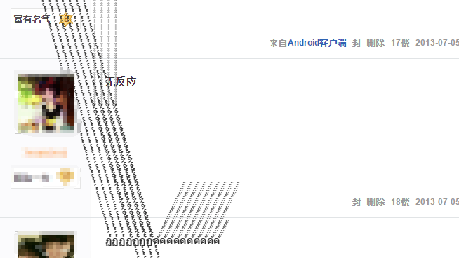

相信你们一定在一些社交网站上看到有人发泰文字符，严重影响了正常的阅读。作为开发者，我们应该采取一些措施解决这个问题。<!--more-->



## PHP

首先，我想到的就是在后端处理，数据入库前清除所有泰文字符。至于清除方法，自然是用正则了。从[维基百科](https://zh.wikipedia.org/wiki/泰文字)上我们可以得到泰文的 Unicode 范围：`U+0E00–U+0E7F`。不过后来我翻了下 PHP 手册，其实不用写 Unicode 范围，直接使用 `Thai`即可。代码大概是这样：

```php
function fuckThai($str){
    return preg_replace('/\p{Thai}/u','',$str);
}
```

或者是

```php
function fuckThai($str){
    return preg_replace_callback('/\p{Thai}/u',
        function(){
            return '';
    },$str);
}
```

使用的话就是`fuckThai('泰文')`

这样一劳永逸，不过如果网站有泰国的用户就不太好了。。

## CSS

用 CSS 也是可以解决的，不过不太完美，只能让泰文字符不“乱飞”。

具体效果如图：（红色边框是我为了更好显示特意加上去的）


方法很简单，给对应元素加上 `overflow: hidden` 的 CSS 即可。

## 最后

如果我们想在浏览贴吧时不被这些泰文烦恼，我们可以写一个 `油猴` 脚本对内容就行处理，思路同上面的[PHP](#PHP)，具体代码我这里就不写了。其实是没写过油猴的，不会写（逃

## 参考

[PHP:Unicode 字符属性](http://php.net/manual/zh/regexp.reference.unicode.php)
