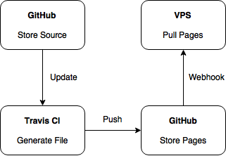

If you see this post, then it works!<!--more-->

> 用得好好，就不要瞎折腾

## 缘起

最近因为 Coding Pages 的[自定义域名收费](https://www.v2ex.com/t/353768)了，一时也找不到比较好的支持 SSL 的 Pages 服务（GitLab Pages 虽然支持 SSL，但是要自己提供证书，感觉还不是很方便）。看了[这个帖子](https://www.v2ex.com/t/360701)后，还是决定将博客放到自己的 VPS 上。

## 流程



博客的源代码放在 GitHub 上，一更新就通过 Travis CI 自动 generate 并 push 到另外一个 repo，这个 repo 通过 webhook 的方式通知 vps，vps 更新文件。

整个流程可以说是非常非常麻烦，我弄好后突然发现可以通过 Dropbox 进行本地与 vps 的同步。。。

## 一些参考

### .travis.yml

```yaml
language: node_js
node_js:
  - '6'

cache:
  directories:
    - node_modules

branches:
  only:
    - master

install:
  - npm install

script:
  - hexo cl
  - hexo g

after_script:
  - cd ./public
  - git init
  - git config user.name "giuem"
  - git config user.email "email_adress"
  - git add .
  - git commit -m "auto deploy via Travis CI."
  - git push --force --quiet "path-to-your-repo" master:pages
```

为了方便，我直接把存放源文件和静态页面放在同一个 repo 的不同分支下，这样就不用在添加 ssh 密钥了。

### deploy

~~这个我直接做成 [Docker 镜像](https://hub.docker.com/r/giuem/blog-deploy/)了~~

发现有几个配置写死了，直接给代码好了

#### deploy.sh

```bash
#!/bin/sh

rm pages -rf
git clone -b pages https://$GITHUB_TOKEN@github.com/giuem/blog.git pages
```

#### webhook.js

```javascript
const http = require('http');
const crypto = require('crypto');
const exec = require('child_process').exec;

const secret = process.env.SECRET || false;
const port = process.env.PORT || 8089;

function verify_signature(sign, body) {
  if (!secret) return true;
  return (
    sign ===
    'sha1=' + crypto.createHmac('sha1', secret).update(body).digest('hex')
  );
}

http
  .createServer((req, res) => {
    if (
      req.method === 'POST' &&
      req.url === '/auto-deploy' &&
      req.headers['x-github-event'] === 'push'
    ) {
      let body = '';
      let sign = req.headers['x-hub-signature'];

      req.on('data', (buffer) => {
        body += buffer;
        if (body.length > 1e6) {
          req.connection.destroy();
        }
      });

      req.on('end', () => {
        if (verify_signature(sign, body)) {
          let json = JSON.parse(body);
          if (json['ref'].indexOf('pages') !== -1) {
            console.log('Verify successfully, now start deploying...');
            exec('sh ./deploy.sh');
          }
        }
        res.end();
      });
    } else {
      res.end();
    }
  })
  .listen(port, () => {
    console.log('service start at', port);
  });
```

## 总结

折腾了一圈突然发现还是动态博客好，重新体验了下。发现 WordPress 还是不支持 Markdown，Ghost 新版用了 mobiledoc 听都没听过，最后又滚回 HEXO 了。。。

**没事真的别折腾，不如多写几道高数题！**
