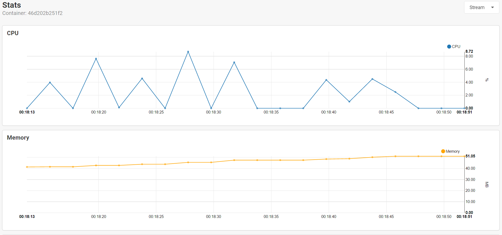
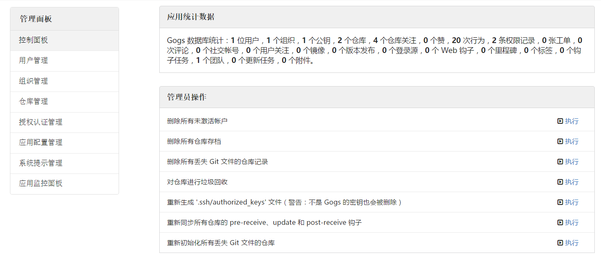

Github 的私有仓库是收费的，学生包申请很麻烦，就一直没去弄，至于国内的一些 Git 托管……请给云计算一点宽容。所以就利用 Gogs 搭建自己的 Git 服务器来托管一些个人项目。<!--more-->

~~[演示地址](https://git.giuem.com)（关闭注册，强制登录浏览，所以只有登陆页面）~~

已经改为使用 GitHub 私有仓库了，学校的邮箱申请秒过，自己维护感觉还是太麻烦了（囧

## Gitlab or Gogs

[Gitlab](https://gitlab.com/) 对服务器的配置要求太高，手上的服务器全都是捡垃圾来的小鸡，所以就没有考虑。

而 [Gogs](https://gogs.io/) 对配置基本没有要求，甚至只要一块树莓派就能运行，虽然说现在还有许多 bug ，Github 上那么多的 issue 和 pr 没解决。（不过反正是自己用，有什么问题忍忍就过去了

## 安装

我是利用 Docker 进行部署的，关于 Docker 有时间可能会写一篇文章安利下。总之，Docker 部署各种应用真是不要太简单，几行命令敲一敲就行了，不用关心宿主机的环境依赖。

如果还没主机上没有安装 Docker，可以看下 [安装方法](https://docs.docker.com/engine/installation/)

### 拉取镜像

```bash
$ docker pull gogs/gogs
```

### 建立目录

```bash
$ mkdir -p /var/gogs
```

目录不一定是 `/var/gogs`，你也可以放在 `/home` 下

### 初始化

```bash
docker run --name=gogs -p 10022:22 -p 10080:3000 -v /var/gogs:/data gogs/gogs
```

这里的 `/var/gogs` 需要改成上一步创建的目录，端口号 `10022`、`10080` 可以换成其它的。

之后如果要管理 Gogs 就可以直接输

```bash
$ docker [start|stop|restart] gogs
```

### 配置

访问 `http://<ip>:<port>` 进行配置

配置中有几个参数是比较重要的：

- **Repository Root Path** 和 **Run User** ：保持默认
- **Domain**：改成你要设置的域名或 ip 地址，如 `git.giuem.com`
- **SSH Port** 和 **HTTP Port** ：改为启动时暴露的端口，如 `10022` 和 `10080`
- **Application URL**：完整的访问地址，如 `https://git.giuem.com`

数据库我选择的是 SQLite3，考虑到内存占用，没有选择 MySQL，而且个人使用 SQLite3 足够了。

其他的配置可以 **[看这里](https://gogs.io/docs/advanced/configuration_cheat_sheet.html)**，配置文件在 `/var/gogs/gogs/conf/app.ini`，改完配置重启 Docker 容器就行。

## 备份数据

Gitlab 误删数据库，所有的备份方法都失效的事件才发生不久。我也是吸取了教训，搭完 Gogs 立马写了个脚本定时备份。

目前采用的方案是每天凌晨自动打包 `/var/gogs` 目录下所有文件上传到 Dropbox，用的是 [Dropbox Uploader](https://github.com/andreafabrizi/Dropbox-Uploader)

等过段时间再折腾下 rsync 就稳了。。

## 附

### 运行时资源占用图



### 后台界面


