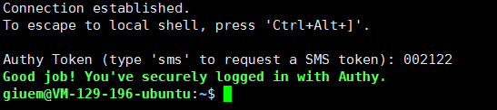
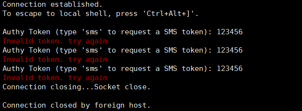

下午爆出 Xshell 的多个版本存在后门，会上传用户名密码，一直在用的表示很受伤 QAQ（当初因为 PuTTY 有后门才转的 Xshell。。我第一时间更新了版本，并更换 SSH 密钥。不过看登录日志和后台程序，没有发现任何异常。但是为了保险起见，我给 SSH 加上了两步验证。<!--more-->

我之前一直使用的就是 Authy，这次也不例外，选择 Authy 作为两步验证器。（没用过 Google Authenticator，有没有用过的过来分享一下）

按照*[官网的说明](https://www.authy.com/integrations/ssh/)*很轻松的就配置好了。这里有点坑的是居然还要去 Twilio 再注册一个帐号获取 API key。

效果

三次失败后断开连接

