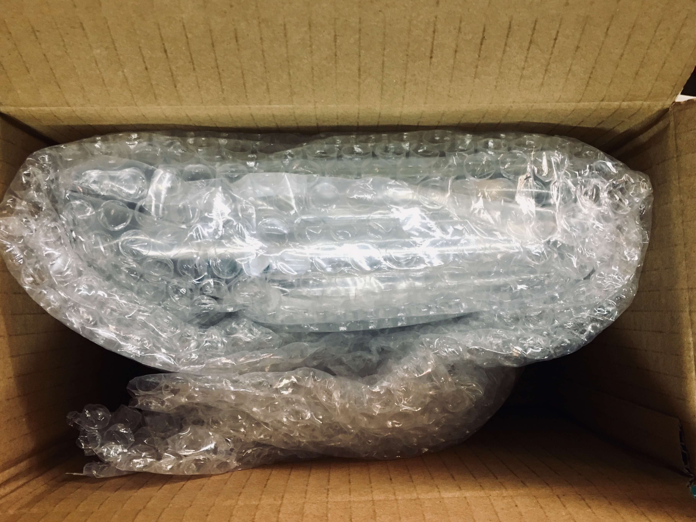
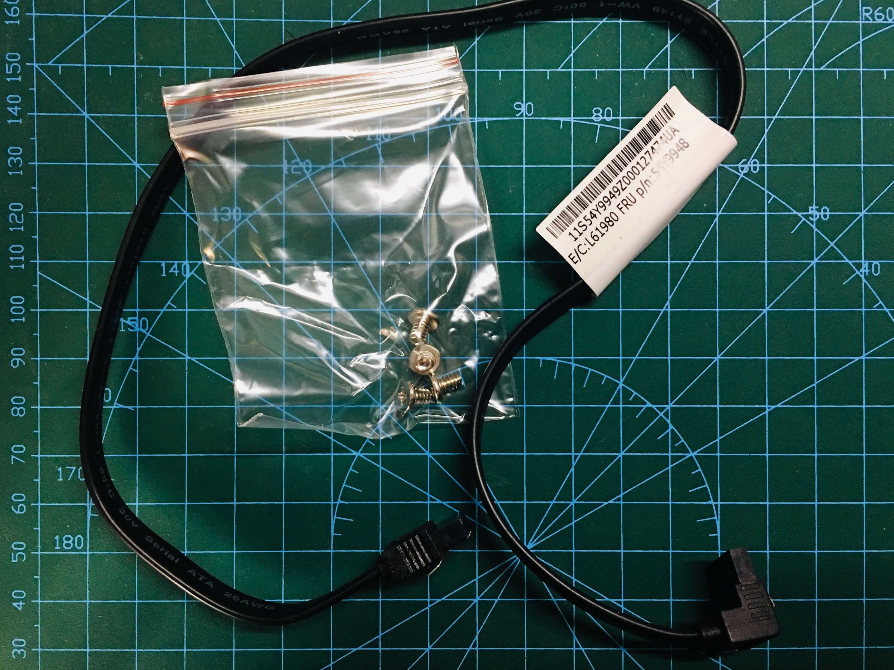
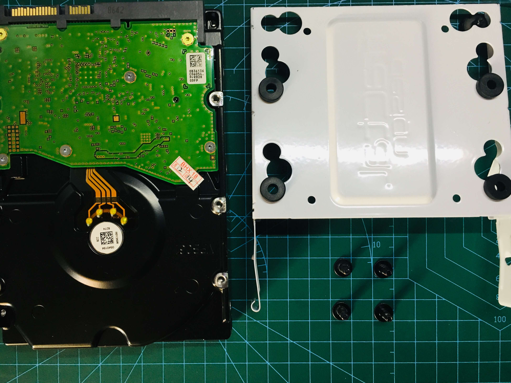
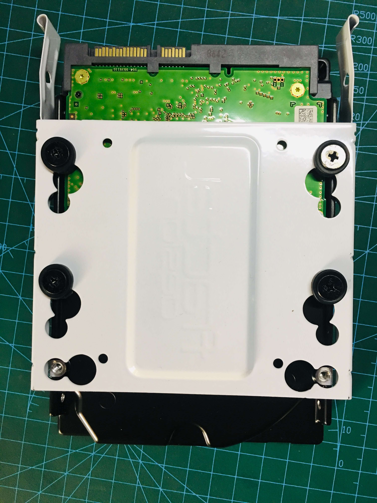
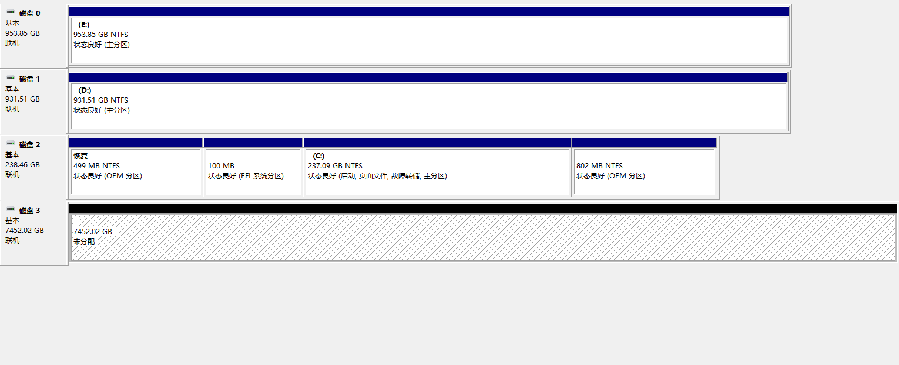
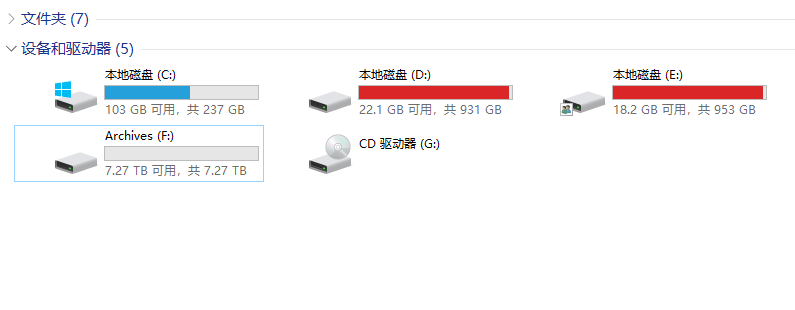
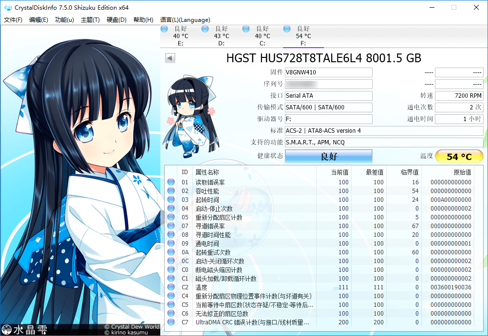
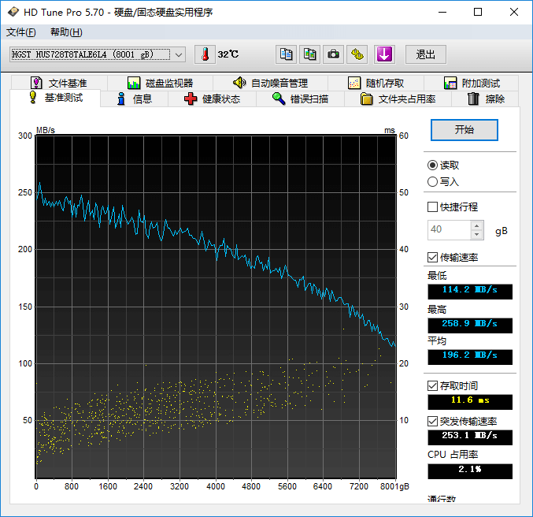
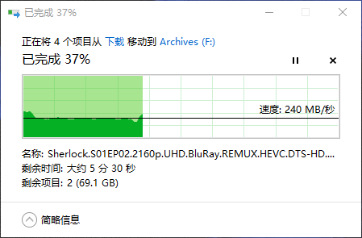
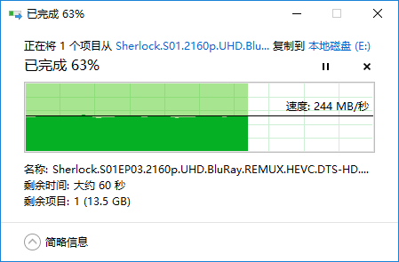

迫于最近沉迷 PT，加上学校 200M/80M 的带宽，电脑存了各种原盘 4K 电影，原来的存储空间已经完全不够用了。思来想去，在马云家剁了块 8T 硬盘 HUS728T8TALE6L4，双十二到手价 1496 元。

平时各种评测见得多了，这次就试着也做一期评测。(本文共 19 张图片，4.71 MB) <!--more-->

## 开箱评测

到手开箱，这包装不算特别厚实，感觉可以再来几层气泡纸。

拿掉气泡纸，又是一层包装。

除了硬盘本体，还附赠一根 SATA3 数据线和 4 颗螺丝。

正面标签，生产于 2018 年 8 月 22 日泰国。这块盘是业界首款 5 碟 8TB 的机械硬盘，缓存 256M。LOGO 显示是西数，但其实是 HGST 的盘体。

上螺丝，准备装机。送的螺丝用不上，这里用的是机箱的螺丝。

组装完成。

机箱型号 Fractal Design Define C TG，有 2 个 3.5" 硬盘位和 3 个 2.5" SSD 槽。其中一个 3.5" 硬盘位已经装了一块 1TB 的西数绿盘。（请不要在意理线，等我有钱了一定买定制线）

上机，稍微理了下线，然而还是很丑。

开机，磁盘管理器已经识别出来了，显示 7452 GB。

格式化。

OK。

其他两块硬盘已经红了。。你们装不下的东西，让大哥帮忙扛着！

使用 HD Tune 查看信息，通电次数 2 次，通电时间 0 小时。

CrystalDiskInfo 基本信息。（这时正在扫描扇区，已经持续了一个多小时。温度有点高。噪音由于是静音机箱，所以不是很明显）

坏道扫描，扫了 11 个小时。。。

HD Tune 持续读写测试，各方面都非常优秀。特别是写入时的存取时间竟然只有 0.4 ms。

实际写入测试，从固态硬盘中拷贝「神探夏洛克」第一季，3 个文件共 110 G。速度在 240 MB/s 上下浮动，非常稳定！

实际读取测试，从机械拷到固态，速度稳定在 240 ~ 250 MB/s。

4K 读取这里就不测了，机械硬盘更多是作为仓储盘使用，4K 性能我并不是很关心。

更多测试可以看这里 [HGST Ultrastar 7K8/DC HC320 8TB HUS728T8TALE6L4 小测](https://www.chiphell.com/thread-1845728-1-1.html)

## 总结

总的来说，这块盘某宝价格在 1550 元左右，算下来每 TB 价格只有 193.75 元；同时性能表现非常不错，日常使用读写速度在 240 MB/s 左右，基本到达机械硬盘的天花板。

性价比超高，值得购买！
