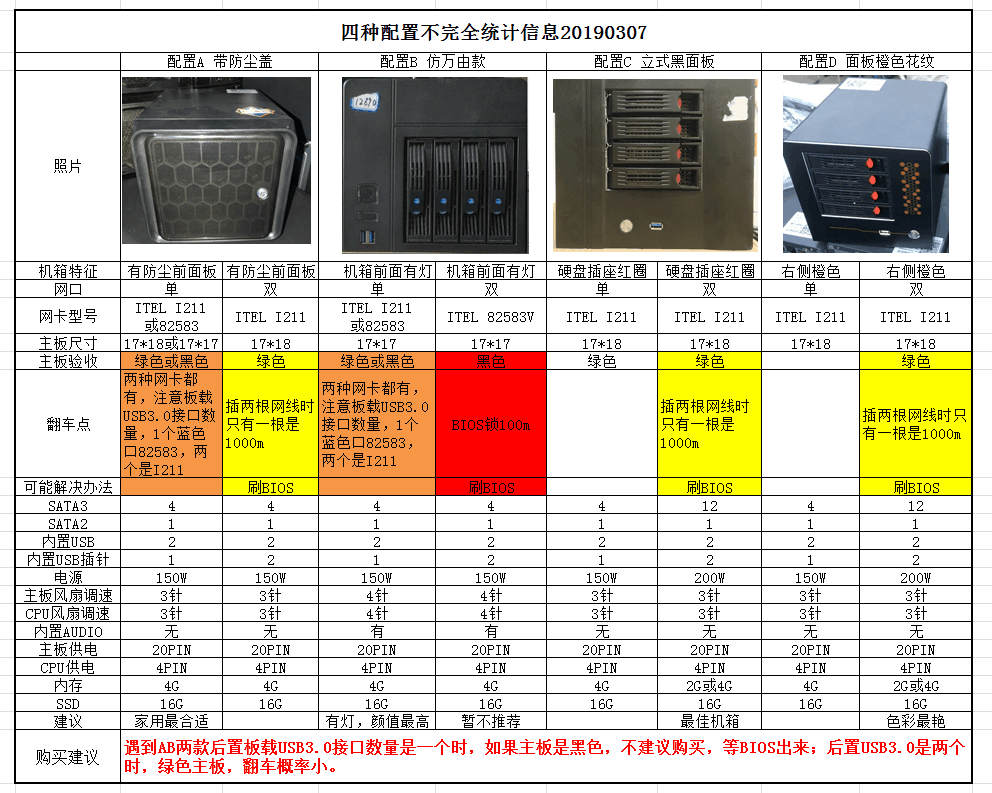
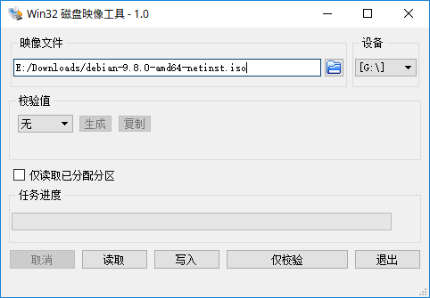

上了最近很火的“蜗牛星际”J1900 NAS 矿车。一般说到矿车，都是大功率电源、显卡这些。这批 J1900 矿车其实挖的是另一种矿—— IPFS / CAI。一开始卖 5000 多一套，都后来 CAI 价格跌到谷底，矿老板清盘，这才有了这批车。<!--more-->

目前这批车主要有 4 种车型。（图转）



我上的是 B 款双网口，闲鱼找了一家说是带纸箱，全新未下矿的。360 大洋入手。现在价格偏高，我认为比较合理的价格应该是双网口 300 左右，单网口 220 左右。据说市场上有 20 万台存货，如果不急可以先等等，后续应该会降价不少的。

等待快递到达的过程中，不少网友说双网口翻车了（见上图翻车点）。我想着我买的 B 款双网口，这不完了吗！结果快递到了后一看竟然寄来的是单网口版本的，成功漂移，车翻回来了。不过，现在双网口的好像也能安全[下车](https://post.smzdm.com/p/amm0x8kz/)了。

## 开箱

机箱是万由 NAS 的，颜值还可以。


看机箱屁股，确认是单网口版的，有两个 USB 3.0 接口。根据型号表可得出网卡为 I211。


150W 的山寨 1U 电源，感觉不是很放心，为了硬盘安全最好换一个好点的。


CPU 由于是 J1900，TDP 只有 10 W。整个机箱一共两个风扇，一个后置机箱风扇和一个电源风扇。


风扇声音非常大，3 PIN 接口不支持 PWM 调速，bios 里也没有 DC 调速选项，果断加一条减速线解决。


看了下主板好像不是很好拆，就没接着拆解了。

## NAS 系统选择

谈到 NAS 系统，大部分人首先想到是黑群晖。但是黑裙每次升级都要小心翼翼，一不小心系统整崩了就完了。其实除了黑裙，还有其他不错的 NAS 系统可供选择，比如 [FreeNAS](https://freenas.org/), [OpenMediaVault](https://www.openmediavault.org/), [Unraid](https://unraid.net/) 等等。

经过对比，FreeNAS 的[硬件需求](https://www.ixsystems.com/documentation/freenas/11.2/intro.html#hardware-recommendations)太高，这套配置带不起；Unraid 收费不考虑；而 OMV (OpenMediaVault) 的硬件需求极低，你甚至可以用树莓派运行它。所以我决定选用 OMV 作为 NAS 系统。

## 系统安装

OMV 可以通过两种方式进行安装：

- 直接通过[官方 ISO](https://sourceforge.net/projects/openmediavault/files/) 安装
- 基于 Debian 9 系统安装

这里我使用第二种方式，因为官方 ISO **不支持 UEFI 安装**。

### 制作安装 U 盘

因为系统盘只有 16 G，需要最小化安装 Debian 9。

下载[最小光盘映像](https://www.debian.org/CD/netinst/)，然后通过 [Win32 Disk Imager](https://sourceforge.net/projects/win32diskimager/) 将映像文件写入 U 盘。



### 安装系统

插上 U 盘，开机按 F7，选择 U 盘启动。安装教程网上一堆，这里不作过多展示。不过有几点需要注意。

- 由于采用 UEFI 方式，需要建一个 EFI 分区。我的分区方式为 500 MB 的 EFI 分区，4G 的 Swap，剩下的全给根目录（就 16G 没啥好分的）。
- 为了最小的系统空间占用，要安装软件只选择 SSH server。

安装完后，登录系统，输入 `ip a` 看一下内网 IP。然后就可以机器丢一边，用 SSH 连接咯。

### 安装 OMV

添加 OMV 源

```bash
cat <<EOF >> /etc/apt/sources.list.d/openmediavault.list
deb http://packages.openmediavault.org/public arrakis main
# deb http://downloads.sourceforge.net/project/openmediavault/packages arrakis main
## Uncomment the following line to add software from the proposed repository.
# deb http://packages.openmediavault.org/public arrakis-proposed main
# deb http://downloads.sourceforge.net/project/openmediavault/packages arrakis-proposed main
## This software is not part of OpenMediaVault, but is offered by third-party
## developers as a service to OpenMediaVault users.
# deb http://packages.openmediavault.org/public arrakis partner
# deb http://downloads.sourceforge.net/project/openmediavault/packages arrakis partner
EOF
```

使用 Root 用户进行安装

```bash
export LANG=C
export DEBIAN_FRONTEND=noninteractive
export APT_LISTCHANGES_FRONTEND=none
apt-get update
apt-get --allow-unauthenticated install openmediavault-keyring
apt-get update
apt-get --yes --auto-remove --show-upgraded \
    --allow-downgrades --allow-change-held-packages \
    --no-install-recommends \
    --option Dpkg::Options::="--force-confdef" \
    --option DPkg::Options::="--force-confold" \
    install postfix openmediavault
# Initialize the system and database.
omv-initsystem
```

安装完成后，浏览器输入 NAS 的 IP 地址即可登录到管理界面。默认用户名密码为 `admin / openmediavault`。

### 安装 OMV-Extras

OMV-Extras 提供一些额外的插件，比如 ZFS，Docker，Downloader 等等。安装方式很简单，参考[官方说明](http://omv-extras.org/joomla/index.php/guides)。

### 一些优化

#### BIOS 设置

- **关闭通电自启**：Advanced - ACPI Settings - PWRON After Power Loss - Always off
- **开启热插拔**：Advanced - SATA Configure - SATA Port1 HotPlug - Enabled

#### 更换国内镜像

```bash
sed -i 's/deb.debian.org/mirrors.ustc.edu.cn/g' /etc/apt/sources.list
sed -i 's|security.debian.org/debian-security|mirrors.ustc.edu.cn/debian-security|g' /etc/apt/sources.list

sed -i 's/download.docker.com/mirrors.ustc.edu.cn\/docker-ce/g' /etc/apt/sources.list.d/omv-extras-org.list

sed -i 's/httpredir.debian.org/mirrors.ustc.edu.cn/g' /etc/apt/sources.list.d/openmediavault-kernel-backports.list

```

#### 关闭蜂鸣器

```bash
rmmod pcspkr
echo "blacklist pcspkr" >> /etc/modprobe.d/blacklist
```

## OMV 配置

懒得写了，就简单说一下一些必要的配置

- **系统 - 常规设置**：修改登录密码
- **系统 - 插件**：安装插件，推荐 Docker，shellinabox，transmissionbt
- **系统 - OMV-Extras**：开启 Docker CE，开启 backports（可选）
- **储存器 - 磁盘**：配置磁盘的电源策略
- **储存器 - S.M.A.R.T**：开启 S.M.A.R.T
- **储存器 - RAID 管理**：建立软 RAID（可选）
- **储存器 - 文件系统**：创建文件系统，推荐 EXT4
- **访问权限管理 - 用户**：新建用户访问关系文件夹
- **访问权限管理 - 共享文件夹**：创建共享文件夹，可以设置访问权限。（关于访问权限设置，你需要更改文件夹的特权，而不是 ACL）
- **服务 - SMB**：开启 SMB 服务，设置共享文件夹

也可以看 B 站[这个视频](https://www.bilibili.com/video/av33133974)，虽然是 3.x 版本的，但操作基本一样。

## 测试

测试硬盘为希捷酷鱼 1T，局域网内跑满千兆没有翻车~

不过还是不够快呐，本来想双网口搞链路聚合的（小声）


## 参考链接

- 灵车讨论：[https://t.me/nasj1900](https://t.me/nasj1900)
- [DIY 爱好者年度小作品 篇十四：错过了暴风酷播云的 NAS 车，抢上蜗牛星际车随手记](https://post.smzdm.com/p/aek8d7dm/)
- [DIY 爱好者年度小作品 篇十六：蜗牛星际都四盘位 NAS 体验及简介](https://post.smzdm.com/p/akmrxplk/)
- [openmediavault 4.0 documentation](https://openmediavault.readthedocs.io/en/latest/)
