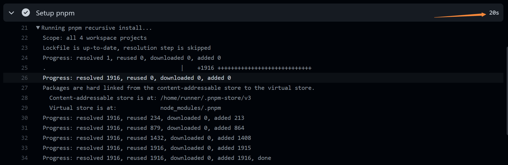

最近对博客进行了一次比较大的更新改版，距离[上一次更新](/a-new-beginning-to-blog)已经 4 年多了，那时还信誓旦旦的说会好好的写博客。结果如今 3 年过去了才写了 9 篇文章，18 年更新了 4 篇文章，19 年更新了 3 篇，20 年更新只更新了一篇。通过观察每年更新的数量不难发现规律，每次更新博客的主题总能刺激写作的欲望，随着时间推移写作的热情逐渐消耗殆尽。

> 嗯，看来是时候对博客进行一波重构，刺激一下创作的欲望了。

## 技术栈调整

### 博客框架

最早我的博客是运行在 WordPress 上的，但是发现我的博客本来更新的频率就不高，完全没必要使用动态博客引擎。那会应该是 15 年吧，静态站点生成器可以选择的并不多，只记得 Hexo 很多人在用，当时的一大趋势就是从 Jekyll 迁移到 Hexo、从动态博客迁移到静态博客。我就是在那时从 WordPress 迁移到 Hexo，并写下了第一款主题 [giuem/hexo-theme-naive](https://github.com/giuem/hexo-theme-naive)，这款主题也得到了很多人的喜欢（[衍生版本有 300 多 star](https://github.com/frostfan/hexo-theme-polarbear)），后来因为我自己看腻了就重新写了一款主题：[giuem/hexo-theme-iris](https://github.com/giuem/hexo-theme-iris)。

在写主题的过程中就会发现，这些基于模板引擎的站点生成器，太过原始（仅个人观点），打包的方式是通过 gulp 甚至没有打包，工程化也很难做起来，每次模板间的引用传参、模板与 JavaScript 的交互都是两眼一抹黑，心里特没底，不知道到底有没有这个参数，各种[优化手段](/how-fast-is-my-blog/#博客的优化)（如资源预加载，Service Worker 等）需要靠非常人工的方式去维护。而且当初主题系统设计得特别 💩，只能通过拷贝文件夹的方式来安装主题（不过后面好像支持通过 NPM 方式安装了）。

这两年国外对于 [JAMStack](https://jamstack.org/) 这一概念炒得特别火，冒出了很多相关的站点生成器，[Gatsby](https://www.gatsbyjs.com/) 就是其中人气较高的一款。

Gatsby 是基于 React/Webpack 技术栈的站点生成器，这意味着你能使用上丰富的 React 和 Webpack 生态，它本身也有非常强大的[插件生态](https://www.gatsbyjs.com/plugins/)。同时一些前端工程化、组件化的方案也能直接拿来使用。Gatsby 还提供了很多开箱即用的优化手段，比如资源的 Preload/Prefetch、响应式图片、内联样式、首屏优化、module/nomodule polyfill 优化，资源拆分等等，默认状态下就能达到 95 分左右的性能体验。

说起 React 生态的站点生成器，[Next.js](https://nextjs.org/) 也是一个很好的选择，但之前在公司内有使用过（踩过坑）Gatsby 的经验，所以我的博客也就选择了 Gatsby。

### Pnpm 与 Monorepe

这次还有一个比较大的调整就是使用了 [Pnpm](https://pnpm.io/) 作为 NPM 包管理工具，[Pnpm Workspace](https://pnpm.io/workspaces) 来管理组织代码仓库（Monorepo）。

Pnpm 即 performance npm，相比其他的包管理工具[性能更好](https://pnpm.io/benchmarks)，使用 Webpack 那一套编译工具就意味着你要装一大堆相关的 NPM 包，使用 Pnpm 能在博客部署时提供更好的性能。实测在有缓存时，目前博客安装依赖（node_modules 体积 ~558M）的时间仅为 **20 秒**。

使用 Monorepo 的主要原因是当社区的插件不能满足需求时，想自己开发插件又不想发包或者不想每次手动的更新 package.json 和 lock 文件中的版本号时，可以通过 Monorepo 的方式把插件代码和博客的代码都放到一个代码仓库中维护，不通过发版就可以使用到最新的插件代码了。Monorepo 还有一个好处是所有的代码都共享一份最佳实践，代码规则的更新只需要修改一个 repo 就可以。

~~我的最终目标是：所有开源的代码都放到这一个仓库中进行维护。~~

### 样式

选择 React/Webpack 技术栈，可以选择的技术就很多了，像 PostCSS, CSS Modules, CSS in JS, utility-first CSS 等等。这几年 utility-first CSS 也是[非常火](https://2020.stateofcss.com/zh-Hans/technologies/methodologies/)；如果熟悉我博客风格，一定知道我的博客走的是性冷淡风格，注重排版和阅读体验，不会有太多花里胡哨的特效。这么一看 Utility-first CSS 就非常适合我的博客，之前简单统计过，博客主题中用的最多的 CSS 属性和特性是 `color`,` font-size`, `margin`, `padding` 和 `flexbox`。所以 Utility-first CSS 对于我完全足够了，不需要使用复杂的预处理器来编译 CSS，而且使用 Utility-first CSS 还有一个好处就是可以把数值都固定到可枚举的常量中，不会出现一个 margin 出现 1234567890 种不同的数值。

框架上选择了老大哥 [Tailwind CSS](https://tailwindcss.com/)，虽然最近又出了个 [Windi CSS](https://windicss.org/)，号称编译的速度更快，但是我在尝试从 Tailwind 切换到 Windi 后发现 typography 插件存在一点 BUG，暂时还是先使用 Tailwind CSS。

### 杂项

> 这里是一些微小的改动，不适合单独拎出来介绍，但是我又觉得有必要讲一讲的

- 统计工具用回了 Google Analytics，ga-proxy 已经不再维护和提供服务了 😭
- 部署方式是 Cloudflare -> Vercel -> GitHub，Cloudflare 回源到 Vercel，GitHub 的更新会触发 Vercel 编译博客
- 由于有图片懒加载，暂时下掉了国内 CDN 节点，静态资源和图片全部走 Cloudflare CDN
- 暂时关闭了 Service Worker，目前发现 Service Worker 和深浅色主题切换有冲突，会出现 flash，等待排查

## 反向升级：减法

之前我的博客主题其实就已经做了很多减法，相比于市面上正常的博客，主要少了：

- 标签/分类
- 文章导航（上一页/下一页）

这版主题会进一步优化，删除更多的元素。

首先被我删除的是首页头图，这个头图其实和文章内容没有半毛钱关系，当时设计这个头图是作为点缀，为了让博客看起来不会那么单调。后面发现其实不要这个图片也是 OK 的，而且头图还会影响到首屏的加载性能。

首页文章的分页也被我删除了，通过统计数据发现后面的页面其实点击率很低，而且和[归档页面](/archives/)在功能定位上存在冲突。试想一下，读者想翻看之前的文章，是一页页的查找更方便呢，还是一步到位在归档页面查看效率更高？答案显然是后者。所以我首页只保留了 6 篇最新的文章，增加一个按钮来链接到归档页面。

另外一个被我删除的东西是文章的发布时间，无论是在首页还是归档页、或者是文章页面都看不到任何时间信息。~~因为我博客更新的频率本来就不高，展示时间岂不是让你们知道我拖更了多久？~~当然你可以通过其他的方式来查看更新的时间，比如 RSS 或者 Sitemap。

## 一些加法

还没做。应该可以再水一篇文章。😘

目前想到的一些功能：

- 灯箱
- 代码块优化
- 站外链接增加图标
- 文章页头图
- 搜索功能
- ……

## 最后

之前我的博客源码一直都是放在私有仓库，这次我也是把博客完整的[开源](https://github.com/giuem/monorepo)了，如果有人也想尝试 Gatsby 希望我的代码能起到一点帮助吧~~，也希望有人能帮我 fix typo 和 bug~~。

最近游戏荒了，正好该给博客除除草了。
